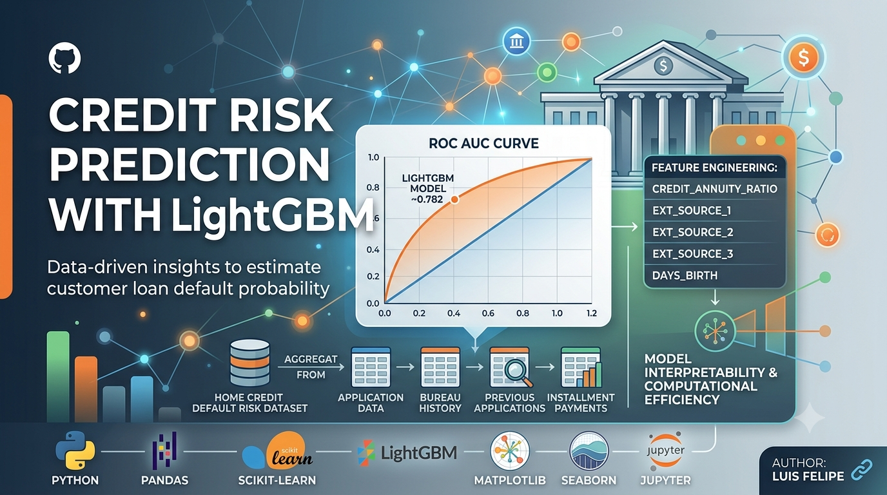
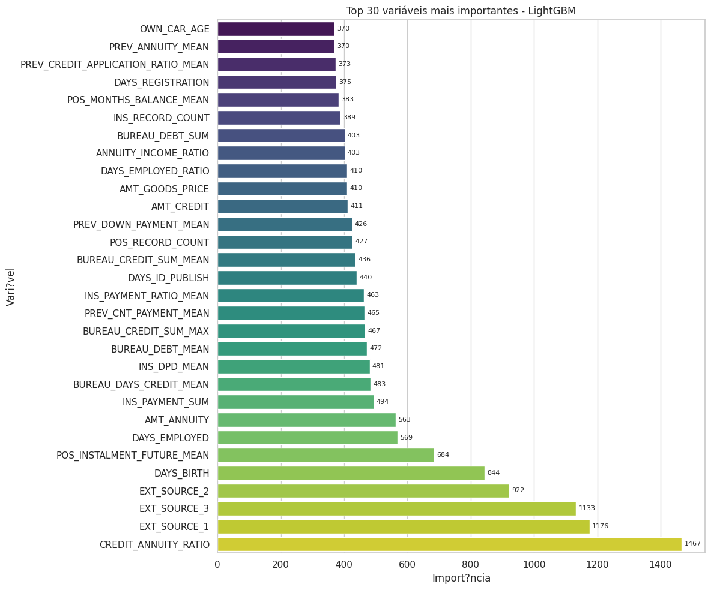

# 📊 Credit Risk Prediction with LightGBM

  

  
  
  
  

  <strong>End-to-end machine learning pipeline for credit default risk prediction.</strong> 
  Includes data preprocessing, feature aggregation, feature engineering, and LightGBM model training with stratified cross-validation.

  <a href="#-overview">Overview</a> •
  <a href="#-methodology">Methodology</a> •
  <a href="#-models--evaluation">Models</a> •
  <a href="#-results">Results</a> •
  <a href="#-key-learnings">Learnings</a> •
  <a href="#-technologies">Technologies</a>

---

## 📌 Overview

This project explores the prediction of customer default risk using the **Home Credit Default Risk** dataset from Kaggle. The objective is to estimate the probability of loan default by combining customer profile information, financial data, previous applications, bureau records, payment history, and behavioral indicators.

### 🎯 Business Problem
Financial institutions need to evaluate the risk associated with granting credit. Traditional approaches often rely on a limited set of variables. This study leverages large volumes of structured data through Machine Learning to identify complex patterns associated with default behavior, supporting credit risk assessment through data-driven insights.

### 📊 Dataset Sources
The final modeling dataset combines information from multiple tables through feature aggregation techniques:
* **Application data** (Main profile info)
* **Bureau credit history** (Financial background)
* **Previous loan applications** & **Installment payments**
* **Credit card balances** & **POS cash balances**

---

## 🛠 Methodology

### 1. Data Preparation
* **Missing values:** Handled according to feature types.
* **Memory optimization:** Reduced DataFrame sizes for better performance.
* **Aggregation:** Multi-dataset relational joins and merges.

### 2. Feature Engineering
Created business-oriented variables to capture financial health:
* `CREDIT_ANNUITY_RATIO` | `CREDIT_TO_INCOME_RATIO`
* `INCOME_PER_FAMILY_MEMBER_RATIO`
* Historical behavioral metrics & employment-related indicators.

---

## 🤖 Models & Evaluation

### ⚙️ Hyperparameter Tuning
A controlled hyperparameter tuning process evaluated learning rates, number of trees, leaves, and regularization. 

> 💡 **Practical Lesson:** While some configurations produced slight improvements, the performance gains were marginal compared to the increase in computational cost. Model complexity does not always translate into meaningful business value.

### 📈 Evaluation Metric
* **Primary Metric:** `ROC AUC` (Receiver Operating Characteristic Area Under the Curve).
* **Why?** It perfectly measures the model's ability to distinguish between default and non-default customers across different decision thresholds in imbalanced credit datasets.

---

## 🏆 Results

### Performance Comparison

| Model | ROC AUC | Status |
| :--- | :---: | :---: |
| **Baseline (Logistic Regression)** | *Baseline* | 📉 Standard |
| **Advanced (LightGBM Classifier)** | **~0.784** | 🚀 **Best Model** |

### 📊 Model Insights & Visualizations

  
   
  <em>Figure 1: LightGBM Model Evaluation & Visual Insights.</em>

### 🔍 Top Predictors (Feature Importance)
1. `CREDIT_ANNUITY_RATIO`
2. `EXT_SOURCE_1`, `EXT_SOURCE_2`, `EXT_SOURCE_3`
3. `DAYS_BIRTH`
4. Bureau-derived aggregated features & payment history metrics.

---

## 📚 Key Learnings

* **Data over Tuning:** Feature engineering often has a greater impact than hyperparameter tuning.
* **Tabular King:** Gradient Boosting models remain highly effective for structured data.
* **Validation is Key:** A robust validation strategy is critical to obtaining reliable performance estimates.
* **Business Reality:** Model interpretability and computational costs remain essential in regulated domains like credit risk.

---

## 🧰 Technologies

  
  
  
  
  

### 🚀 Future Improvements
* [ ] CatBoost implementation and comparison
* [ ] Ensemble methods (LightGBM + CatBoost + XGBoost)
* [ ] SHAP (SHapley Additive exPlanations) execution for interpretability
* [ ] Automated hyperparameter optimization (Optuna)

---

## 📄 Author

**Luis Felipe**  
*Data Analytics | Machine Learning | Procurement Analytics | Business Intelligence*

  

*Feel free to connect, provide feedback, or discuss ideas related to machine learning and credit risk modeling!*
